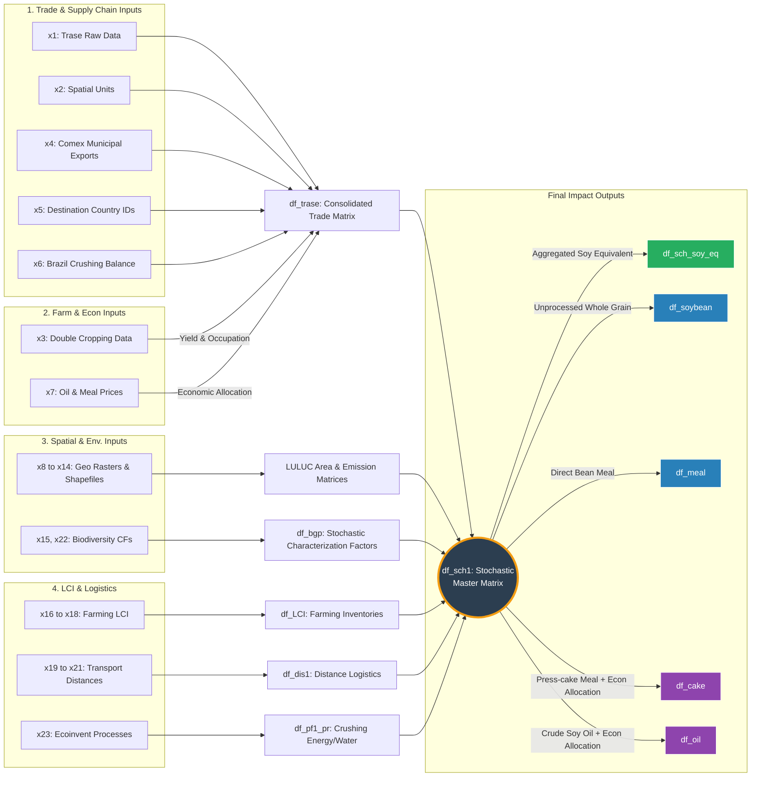

# Biodiversity Loss Impacts of the Brazilian Soy Supply Chain

## Overview
This repository contains the official R implementation and data architecture for estimating the biodiversity loss impacts associated with the international trade of Brazilian soy. Utilizing an **Attributional Life Cycle Assessment (LCA)** framework, the model couples supply chain activity data with spatially explicit layers of biophysical parameters and characterization factors to quantify biodiversity degradation as a linear function of localized land-use activities across the soy supply chain.

Due to the massive, multi-temporal scale of the geospatial assets, the extensive Monte Carlo simulations, and the data-intensive nature inherent to comprehensive LCAs, the complete raw historical infrastructure of this project encompasses a multi-terabyte data volume that far exceeds both the hosting thresholds of GitHub and the standard distribution capacities of public repositories like Zenodo.

---

## Data Architecture, Comprehensive Reproducibility & Storage Constraints
The complete analytical model spans an operational timeline from **2004 to 2022**, relying on wall-to-wall annual geospatial layers (including Land Cover, Soil Organic Carbon, and Burned Area rasters) that require historical baselines stretching from **2001 to 2022**. 

To balance strict compliance with open science principles against these severe storage and system constraints, this repository utilizes a decoupled, **three-tiered hybrid data-sharing architecture**:

1. **Code Repository (GitHub - This site):** Contains all version-controlled R scripts, custom computational functions, technical documentation, and the RStudio project framework (`.Rproj`).
2. **Reproducibility Dataset (Zenodo - Data Core):** Hosts a fully optimized, lightweight data subset engineered exclusively for code validation and pipeline transparency. It includes all structural tabular databases, shapefiles, intermediate checkpoints, and **only the specific spatial raster layers required to successfully execute and verify the pipeline for the default target year (2019) and the filtered verification municipality**. 
3. **Comprehensive Historical Core Dataset:** The complete, uncompressed multi-terabyte historical raster series (2001–2022) used to generate the paper's full-scale national results is securely stored in our institutional repository and is fully available upon request to the corresponding author due to its massive physical size.

---

## Data Availability & Big Data Workflow

To fully replicate the analysis or run the scripts, you must combine the code repository with the heavy data cores hosted on Zenodo. 

### 1. Repository Structure
The project relies on strict relative paths managed via the `here` package. When fully assembled, the root directory must mirror the following structure:

```text
soy-biodiversity-impact-model/
│
├── soy-biodiversity-impact-model.Rproj  # RStudio Project core
├── main_analysis_model.R                # Primary computation script
├── README.md                            # This documentation file
│
├── input_data/                          # [Sourced from Zenodo Archive A]
│   ├── trase_soy_supply_chain.xlsx      # Supply chain matrices
│   ├── land_cover_masks.shp             # Geospatial vector layers
│   └── ... (other input layers)
│
└── output_data/                         # [Sourced from Zenodo Archive B]
    ├── trase_db_imputed_expanded.parquet
    ├── sLULUC_em.parquet                # Final emissions matrix
    └── ... (simulation outputs)
 ```   

```
[ARCHIVOS DE ENTRADA]                 [PROCESAMIENTO INTERMEDIO]               [RESULTADOS FINALES]
                                                                                
x1 (Trase Supply Chain) ----------> df_trase (1, 2, 3) Imputaciones 
                                           │
x2 (Spatial Units) ────────────────────────┼─> [df_trase Consolidada] 
x3 (Double Cropping) ──────────────────────┤   Calcula: sh_bean, sh_meal,
x4 (Comex Municipios) ─────────────────────┤   sh_cake, sh_oil y flujos: ───>  df_sch_soy_eq
x5 (Country IDs) ──────────────────────────┤   (soybean, bean_meal, cake, oil)        │
x6 (Brazil Crushing) ──────────────────────┘                                          │
                                                                                      ▼
x7 (Precios Aceite/Harina) ───────> Asignación Económica (af) ───────────┐    [MATRIZ MAESTRA]
                                                                         ├─>    (df_sch1)
x8 a x14 (Capas Geo/Raster) ──────> Matrices Spatiales y LULUC ──────────┤    Une flujos con
x15, x22 (Factores Biodiv.) ──────> df_bgp (Bucle Estocástico CF) ───────┤    impactos por
x16, x17, x18 (LCI Campo) ────────> df_LCI_pr (Inventario Agrícola) ─────┤    muestra estocástica
x19, x20, x21 (Distancias) ───────> df_dis1 (Logística de Transporte) ───┤    (Id_sample)
x23 (Ecoinvent Procesos) ─────────> df_pf1_pr (Crushing e Insumos) ──────┘            │
                                                                                      │ Desagregación
                                                                                      ├─> df_soybean
                                                                                      ├─> df_meal
                                                                                      ├─> df_cake
                                                                                      └─> df_oil

```

### Data Architecture & Workflow





# Estimating Biodiversity Loss Impacts of the Brazilian Soy International Supply Chain: Code and Data Repository
## Overview
[cite_start]This repository contains the R Studio project, source code, input datasets, and output results for assessing the biodiversity loss impacts driven by the international trade of Brazilian soy[cite: 1]. [cite_start]The evaluation framework is built upon an attributional Life Cycle Assessment (LCA)[cite: 5]. [cite_start]It dynamically links supply chain activity data with spatially explicit characterization factors via linear functions to quantify habitat transformation and occupation impacts[cite: 5]. 

[cite_start]This repository serves as the comprehensive supplementary material for the associated scientific publication[cite: 2].

---

## Repository & Supplementary Material Structure
[cite_start]This research output consists of two main components[cite: 1, 2]:
1. [cite_start]**The RStudio Project (Archived via GitHub):** Contains reproducible source code and required input datasets[cite: 1].
2. [cite_start]**Supplementary Data Tables (Stored directly in Zenodo):** Independent supplementary datasets supporting the main manuscript[cite: 2].

The internal R project directory is organized as follows:
* [cite_start]`input_data/`: Contains raw socio-economic, trade, and spatial datasets (Excel, .csv, raster .TIF, and vector .shp formats)[cite: 6].
* [cite_start]`output_data/`: Stores intermediate checkpoints and final high-resolution estimation results[cite: 8, 24].
* [cite_start]The root directory contains the main execution script and the R project environment file[cite: 7].

---

## Computational Environment & Dependencies
[cite_start]To ensure exact computational reproducibility, the analytical pipeline was executed under the following specifications[cite: 13]:

### Hardware Architecture
* [cite_start]**Processor:** Intel(R) Core(TM) i9-10900K CPU @ 3.70GHz [cite: 15]
* [cite_start]**Installed RAM:** 32.0 GB (31.8 GB usable) [cite: 16]
* [cite_start]**System Type:** 64-bit Operating System, x64-based processor [cite: 17]

### Software Environment
* [cite_start]**R Version:** 4.6.0 (2026-04-24 ucrt) [cite: 18]
* [cite_start]**RStudio Version:** 2026.05.0+218 [cite: 19]

### Required R Packages
| Package | Version | Package | Version |
| :--- | :--- | :--- | :--- |
| `openxlsx` | [cite_start]4.2.8.1 [cite: 20] | `dtplyr` | [cite_start]1.3.3 [cite: 21] |
| `triangle` | [cite_start]1.1.0 [cite: 20] | `raster` | [cite_start]3.6-32 [cite: 21] |
| `arrow` | [cite_start]23.0.1.2 [cite: 20] | `sp` | [cite_start]2.2-1 [cite: 21] |
| `rnaturalearthdata` | [cite_start]1.0.0 [cite: 20] | `terra` | [cite_start]1.9-11 [cite: 21] |
| `sf` | [cite_start]1.1-0 [cite: 20] | `here` | [cite_start]1.0.2 [cite: 21] |
| `tidyverse` | [cite_start]2.0.0 [cite: 21] | | |

---

## Methodological & Implementation Notes

### Data Processing and Imputation Rules
[cite_start]The data pipeline includes cleaning, filtering, data frame merging, spatial cropping, and uncertainty parameter simulation[cite: 9]. [cite_start]Missing data points within the source datasets were handled using strict imputation rules[cite: 11]:
* [cite_start]**Continuous Numeric Variables:** Imputed using weighted mean values[cite: 12].
* [cite_start]**Discrete Variables / Factors:** Imputed using sectorized mode values[cite: 12].

### Memory Optimization & Staged Calculations
[cite_start]Due to computational RAM limitations during big-data spatial processing, calculations are executed in chronological stages[cite: 22]. [cite_start]Intermediate files are cached and subsequently used as inputs to compile the final outputs[cite: 22].

### Code Verification Mode (Quick Run)
[cite_start]To facilitate rapid testing and code verification by external users, a built-in filter option models data for a single municipality and a specific calendar year[cite: 23]. [cite_start]The fully processed dataset, however, is available within the `output_data/` folder[cite: 24].

### Proprietary Data Compliance (Ecoinvent)
* [cite_start]**Note on Input_File 24 (`ecoinvent_unit_processes.xlsx`):** Indicators derived from Ecoinvent v3.10 (modeled in SimaPro) are used in the unit processes[cite: 98]. [cite_start]Because Ecoinvent is a proprietary, paid database, original values in this open-source file have been replaced with a placeholder value of `1`[cite: 99]. [cite_start]Users must consult the original source to apply the exact values[cite: 99].

---

## Data Dictionary: Input Files (`input_data/`)
[cite_start]*Note: All Excel (.xlsx) files contain embedded metadata sheets/legends detailing their specific contents[cite: 204]. For plain-text and spatial formats, descriptions are detailed below[cite: 205].*

| File Identifier | File Name / Path | Description & Source |
| :--- | :--- | :--- |
| **Input 1** | `trase_soy_supply_chain.xlsx` | Annual soy market volumes (2004–2022), origin municipalities, export ports, destination countries, FOB prices, and land use demand. [cite_start]Adapted from Trase[cite: 27, 28, 29, 30, 31]. |
| **Input 2** | `nd2_nd3_spatial_units.xlsx` | [cite_start]Geographic coordinates of export and import ports[cite: 32, 33]. |
| **Input 3** | `soy_maize_double_cropping.xlsx` | Soy and maize harvest data by Brazilian municipality (2004–2022) to estimate double-cropping magnitude. [cite_start]Sourced from IBGE-SIDRA[cite: 34, 35, 36]. |
| **Input 4** | `brazil_municipal_exports_2025.csv` | International trade data (1997–2025) for SH4 codes (2304, 1201, 1507, 1208) to allocate commodities to supply chains. [cite_start]Sourced from IBGE-COMEX[cite: 37, 38, 39, 40, 41]. |
| **Input 5** | `destination_countries_id.xlsx` | [cite_start]Identification data for destination countries used for dataframe linkage[cite: 43, 44, 45]. |
| **Input 6** | `brazil_crushing.xlsx` | Monthly domestic soy commodity commercial balance per municipality (1998–2024). [cite_start]Sourced from ABIOVE[cite: 46, 47, 48]. |
| **Input 7** | `soy_oil_and_meal_prices.xlsx` | Economic values and trade volumes for soy cake and oil (2022) used for economic allocation. [cite_start]Sourced from ABIOVE[cite: 49, 50, 51]. |
| **Input 8** | `shp/br_municipalities_2021/br_municipalities_2021.shp` | [cite_start]Polygon vector layer of Brazilian municipalities for spatial identification[cite: 52, 53]. |
| **Input 9** | `raster/raster1/ecological_zone_BR.tif` | [cite_start]IUCN ecological zones raster clipped for Brazil, mapped to IPCC carbon/biomass stocks[cite: 54, 55, 56]. |
| **Input 10** | `raster/land_cover/land_cover_` | MapBiomas Collection 8 land cover raster (30m). *Note: Due to storage constraints, only 2016 and 2019 are provided for code verification. [cite_start]The full series (2001–2022) is available at MapBiomas*[cite: 57, 58, 59, 60]. |
| **Input 11** | `raster/soil_organic_carbon_soc/soc_` | Soil Organic Carbon (SOC) raster (30cm depth, 30m resolution, Beta1). *Note: Years 2016 and 2019 provided; full series at MapBiomas*[cite: 61, 62, 63, 64, 65]. |
| **Input 12** | `raster/burned_area/burned_area_` | Burned area event raster (30m) to estimate non-CO2 emissions from land clearing. *Note: Years 2016 and 2019 provided; full series at MapBiomas*[cite: 66, 67, 68, 69, 70]. |
| **Input 13** | `land_use_types.xlsx` | IPCC parameters for calculating carbon stock changes across land-use types and ecological zones[cite: 71, 72]. |
| **Input 14** | `eco_municipalities.shp` | Spatial intersection vector layer mapping municipal boundaries against ecoregions to downscale biodiversity CFs[cite: 73, 74, 75]. |
| **Input 15** | `cf_biodiversity_loss_luluc.xlsx` | Biodiversity loss Characterization Factors (CFs) for habitat transformation and occupation from Scherer et al. (2023) [cite_start][cite: 76, 77, 78]. |
| **Input 16** | `lci_soy_production.xlsx` | LCA foreground activity data for farming/processing stages compiled from 22 scientific articles (2011–2023)[cite: 79, 80]. |
| **Input 17** | `on_field_emission_factors.xlsx` | Emission factors for fertilizers/soil amendments (IPCC) and fossil fuel combustion (Sphera)[cite: 81, 82]. |
| **Input 18** | `n_and_c_content.xlsx` | Nitrogen and Carbon content in fertilizer products and soil amendments[cite: 83, 84]. |
| **Input 19** | `domestic_distance.xlsx` | Freight distances from origin to export port calculated via QGIS OpenRouteService (ORS)[cite: 85, 86, 87]. |
| **Input 20** | `international_maritime_distance.xlsx`| Maritime shipping routes calculated via QGIS Least Cost Path algorithm with navigable constraints[cite: 88, 89, 90]. |
| **Input 22** | `international_overland_distance.xlsx`| International overland trade transit distances calculated via QGIS ORS[cite: 91, 92]. |
| **Input 23** | `cf_biodiversity_loss_emissions_luluc.xlsx`| LC-Impact (v1.2) characterization factors for biodiversity loss linked to emissions[cite: 93, 94, 95]. |
| **Input 24** | `ecoinvent_unit_processes.xlsx` | Ecoinvent v3.10 unit process indicators (SimaPro). *Values anonymized to `1` for licensing compliance*[cite: 96, 97, 98, 99]. |

---

## Data Dictionary: Output Files (`output_data/`)

### Output 1: `trase_db_imputed_expanded.parquet` [cite: 101]
Imputed Trase database expanded with double-cropping practices and individualized soy commodity market splits[cite: 102, 103].
* [cite_start]**Location/Routing:** `export_port_code` [cite: 112][cite_start], `export_port_name_mo` (reassigned ports for logical transoceanic shipping) [cite: 113, 114, 115][cite_start], `port_municipality_code` [cite: 116][cite_start], `municipality_code` [cite: 123][cite_start], `import_country_name` [cite: 105][cite_start], `import_port_name`[cite: 147].
* [cite_start]**Socio-Economic & Logistics:** `fob` [cite: 133][cite_start], `exporter_name` [cite: 128][cite_start], `importer_name` [cite: 130][cite_start], `transport_type`[cite: 144].
* [cite_start]**Agricultural Dynamics:** `soy_eq` [cite: 132][cite_start], `land_use` [cite: 134][cite_start], `soy_yield` [cite: 152][cite_start], `double_cropping_share`[cite: 153].
* [cite_start]**Commodity Splits:** `soybeans_a`, `meal_a`, `oil_a`, `cake_a` [cite: 157, 158, 159, 160][cite_start], `sh_crusing_to` [cite: 173][cite_start], domestic/international allocation factors (`dom_kmeal_af`, `for_oil_af`, etc.)[cite: 174, 175, 176, 177].
* [cite_start]**Data Quality Indicators:** `municipality_data_quality` [cite: 135][cite_start], `export_port_data_quality` [cite: 136][cite_start], `import_country_data_quality` [cite: 137][cite_start], `land_use_quality_data` [cite: 140][cite_start], `double_cropping_quality`[cite: 154].

### [cite_start]Output 2: `Eco_zone_area_mun.parquet` [cite: 178]
[cite_start]Mapped municipal areas distributed by IUCN ecological zone type[cite: 179].
* [cite_start]`municipality_code` [cite: 180][cite_start], `eco_zone` [cite: 181][cite_start], `area_eco_zone`[cite: 182].

### [cite_start]Output 3: `l_cover_area_full.parquet` [cite: 183]
[cite_start]Municipal land cover shifts over a 3-year prior window relative to the analysis year[cite: 184].
* [cite_start]`cov0` (Land cover 3 years prior) [cite: 186][cite_start], `cov1` (Current land cover) [cite: 187][cite_start], `burnt` (Binary wildfire event: 1=Yes, 0=No) [cite: 188][cite_start], `npixel` [cite: 189][cite_start], `csoc_md` (Soil organic carbon delta) [cite: 190][cite_start], `area` [cite: 191][cite_start], `municipality_code` [cite: 192][cite_start], `year`[cite: 193].

### Output 4: `sLULUC_em.parquet` [cite: 194]
Uncertainty simulation iterations computing Land-Use Change derived emissions[cite: 195, 196, 197, 198].
* [cite_start]Emissions: `CO2e_soc` (from SOC changes) [cite: 199][cite_start], `CO2e_bmb` (above-ground biomass carbon changes) [cite: 200][cite_start], `CH4e`, `N2Oe`, `NOxe` (from biomass burning during clearing)[cite: 201, 202, 203].

---
## Supplementary Data Tables (Stored in Zenodo)
[cite_start]*Note: Any additional Excel files uploaded to the main Zenodo repository alongside this project code are supplementary to the manuscript text[cite: 2]. [cite_start]Every supplementary Excel file includes a dedicated internal sheet detailing variable definitions, units, and methodological context[cite: 204].*

---
## License
This repository is licensed under the **MIT License** for the source code and software scripts, and the **Creative Commons Attribution 4.0 International (CC-BY 4.0)** for the datasets and metadata structures.
