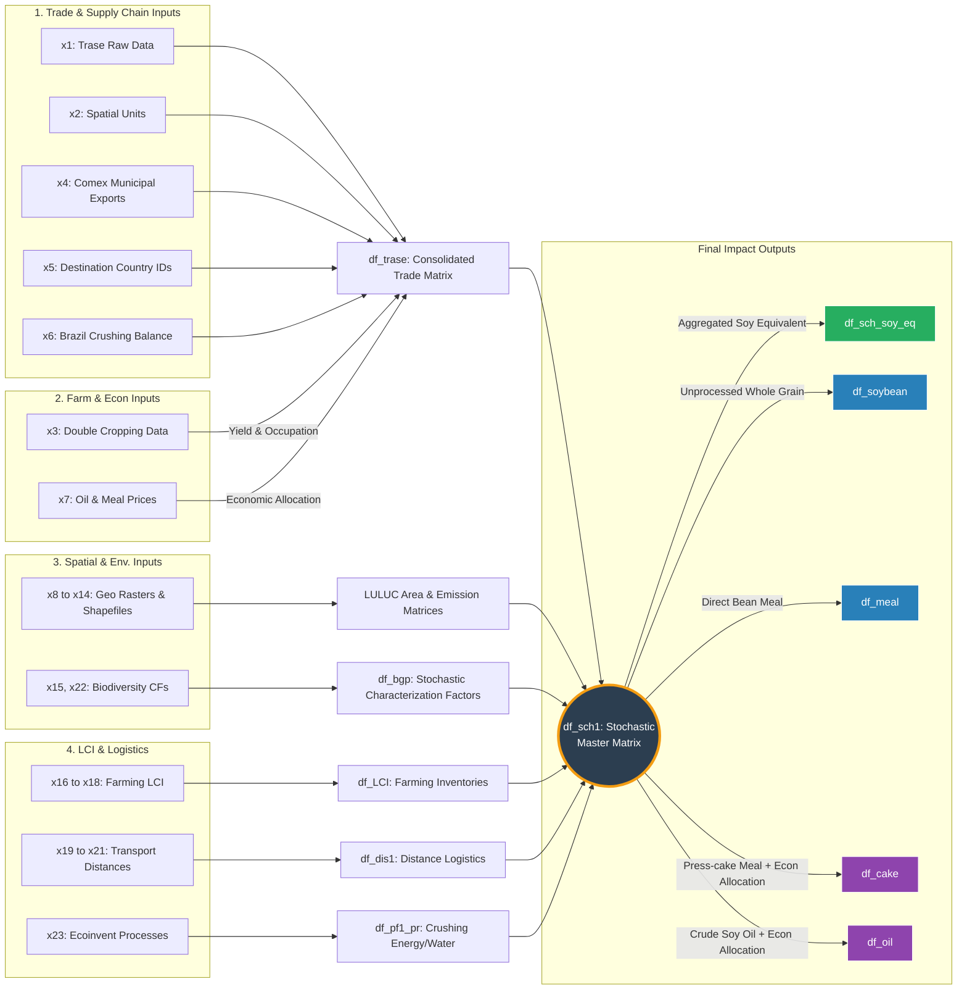

# Biodiversity Loss Impacts of the Brazilian Soy Supply Chain

## Overview
<p align="justify">
This repository contains the R implementation and data architecture for estimating the biodiversity loss associated with the international trade of Brazilian soy. Utilising an **attributional Life Cycle Assessment (LCA)** framework, the model couples supply chain activity data with spatially explicit layers of biophysical parameters and characterisation factors to quantify biodiversity degradation as a linear function of activities across the soy supply chain.
</p>

<p align="justify">
This repository serves as the comprehensive supplementary material for the associated scientific publication [xxxx]
</p>

## Data Availability and Reproducibility Framework
<div align="justify">
Due to the multi-terabyte size of the high-resolution geospatial and LCA datasets (spanning 2004–2022), the complete analytical infrastructure exceeds the standard storage limits of platforms like GitHub and Zenodo. To ensure open science, transparency, and computational reproducibility, we implemented a decoupled hybrid data-sharing architecture:

Code Repository (GitHub): Serves as the central platform for methodological transparency, hosting all version-controlled R scripts, custom functions, documentation, and the complete RStudio project structure (.Rproj).

Reproducibility Dataset (Zenodo): Functions as the core package for workflow validation. It provides an optimised, lightweight subset—including tabular databases, shapefiles, intermediate outputs, and specific raster layers—designed to fully execute and verify the pipeline for a default reference year (2019) and a single selected municipality.

Comprehensive Core Dataset: Datasets omitted from Zenodo due to storage limitations or restrictive licensing types, which are necessary to obtain the full comprehensive results of the study, as detailed further below. Specific instructions for accessing and obtaining these files are provided in the description section of each dataset.

To fully replicate the analysis or run the scripts, users must combine the R code with the data cores hosted on Zenodo. 
</div>
---

### Repository Structure
The project relies on strict relative paths. When fully assembled, the root directory must mirror the following structure:

```text
soy-biodiversity-loss-model/
│
├── soy-biodiversity-impact-model.Rproj  # RStudio Project core
├── main_analysis_model.R                # Primary computation script
├── README.md                            # This documentation file
│
├── input_data/                          # [Sourced from Zenodo Archive A]
│   ├── trase_soy_supply_chain.xlsx      # Supply chain matrices
│   ├── land_cover_masks.shp             # Geospatial vector layers
│   └── ... (other input layers)
│
└── output_data/                         # [Sourced from Zenodo Archive B]
    ├── trase_db_imputed_expanded.parquet
    ├── sLULUC_em.parquet                # Final emissions matrix
    └── ... (simulation outputs)
 ```   

### Data Architecture & Workflow



## Data Dictionary: Input Files (`input_data/`)
*Note: All Excel files (.xlsx) contain embedded metadata sheets/legends detailing their specific contents. Description for plain-text and spatial formats are detailed below*

| File Identifier | File Name / Path | Description & Source |
| :--- | :--- | :--- |
| **Input 1** | `trase_soy_supply_chain.xlsx` | <div align="justify"> Annual soy market volumes (2004–2022), origin municipalities, export ports, destination countries, FOB prices, and land use demand. Adapted from Trase [^1].</div> |
| **Input 2** | `nd2_nd3_spatial_units.xlsx` |Geographic coordinates of export and import ports[^2].|
| **Input 3** | `soy_maize_double_cropping.xlsx` |<div align="justify">  Soy and maize harvest data by Brazilian municipality (2004–2022) to estimate the magnitude of double-cropping. Sourced from IBGE-SIDRA[^3]. </div>|
| **Input 4** | `brazil_municipal_exports_2025.csv` | <div align="justify"> International trade data (1997–2025) for SH4 codes (2304, 1201, 1507, 1208) to allocate commodities to supply chains. Sourced from IBGE-COMEX [^4].</div> |
| **Input 5** | `destination_countries_id.xlsx` | <div align="justify"> Identification data for destination countries used for dataframe linkage [^5].</div>|
| **Input 6** | `brazil_crushing.xlsx` | <div align="justify"> Monthly commercial balance of domestic soy commodity per municipality (1998–2024). Sourced from ABIOVE [^6]. </div>|
| **Input 7** | `soy_oil_and_meal_prices.xlsx` | <div align="justify"> Economic values and trade volumes for soy cake and oil (2022) used for economic allocation. Sourced from ABIOVE[^6].</div> |
| **Input 8** | `shp/br_municipalities_2021/br_municipalities_2021.shp` |<div align="justify"> Polygon vector layer of Brazilian municipalities for spatial identification [^7]. </div>|
| **Input 9** | `raster/raster1/ecological_zone_BR.tif` | <div align="justify"> IUCN ecological zones raster clipped for Brazil, mapped to IPCC carbon/biomass stocks [^8].</div> |
| **Input 10** | `raster/land_cover/land_cover_` |<div align="justify">  MapBiomas Collection 8 land cover raster (30m). *Note: Due to storage constraints, only 2016 and 2019 are provided for code verification. The full series (2001–2022) is available at MapBiomas* [^9].</div>|
| **Input 11** | `raster/soil_organic_carbon_soc/soc_` | <div align="justify"> Soil Organic Carbon (SOC) raster (30cm depth, 30m resolution, Beta1). *Note: Years 2016 and 2019 provided; full series at MapBiomas* [^10].</div> |
| **Input 12** | `raster/burned_area/burned_area_` |<div align="justify">  Burned area event raster (30m) to estimate non-CO2 emissions from land clearing. *Note: Years 2016 and 2019 provided; full series at MapBiomas*[^11].</div> |
| **Input 13** |<div align="justify">  `land_use_types.xlsx` | IPCC parameters for calculating carbon stock changes across land-use types and ecological zones[^12].</div> |
| **Input 14** |<div align="justify">  `eco_municipalities.shp` | Spatial intersection vector layer mapping municipal boundaries against ecoregions to downscale biodiversity CFs[^13][^14].</div> |
| **Input 15** |<div align="justify">  `cf_biodiversity_loss_luluc.xlsx` | Biodiversity loss Characterization Factors (CFs) for habitat transformation and occupation from Scherer et al. (2023)[^15]. </div>|
| **Input 16** |<div align="justify">  `lci_soy_production.xlsx` | LCA foreground activity data for farming and processing stages compiled from 22 scientific articles (2011–2023)[^16].</div> |
| **Input 17** |<div align="justify">  `on_field_emission_factors.xlsx` | Emission factors for fertilisers and soil amendments [^18], and fossil fuel combustion (Sphera)[^17]. </div>|
| **Input 18** |<div align="justify">  `n_and_c_content.xlsx` | Nitrogen and carbon content in fertilisers and soil amendments[^18]. </div>|
| **Input 19** |<div align="justify">  `domestic_distance.xlsx` | Freight distances from origin to export port calculated via QGIS OpenRouteService (ORS)[^19]. </div>|
| **Input 20** |<div align="justify">  `international_maritime_distance.xlsx`| Maritime shipping routes calculated via QGIS Least Cost Path algorithm with navigable constraints[^20].</div> |
| **Input 22** |<div align="justify">  `international_overland_distance.xlsx`| International overland trade transit distances calculated via QGIS ORS[^21]. </div>|
| **Input 23** |<div align="justify">  `cf_biodiversity_loss_emissions_luluc.xlsx`| LC-Impact (v1.2) characterisation factors for biodiversity loss linked to emissions[^22].</div> |
| **Input 24** |<div align="justify">  `ecoinvent_unit_processes.xlsx` | Univt process indicators from Ecoinvent v3.10, modelling by SimaPro (https://simapro.com/). *Values anonymised to `1` for licensing compliance*[^23].</div> |

---

## Data Dictionary: Output Files (`output_data/`)

### Output 1: `trase_db_imputed_expanded.parquet`
Imputed Trase database expanded with double-cropping practices and individualised breakdowns of soy commodity market.
* **Location/Routing:** `export_port_code`, `export_port_name_mo` (reassigned ports for logical transoceanic shipping) , `port_municipality_code`, `municipality_code`, `import_country_name`, `import_port_name`.
* **Socio-Economic & Logistics:** `fob`, `exporter_name`, `importer_name`, `transport_type`.
* **Agricultural Dynamics:** `soy_eq`, `land_use`, `soy_yield`, `double_cropping_share`.
* **Commodity Splits:** `soybeans_a`, `meal_a`, `oil_a`, `cake_a`, `sh_crusing_to`, domestic/international allocation factors (`dom_kmeal_af`, `for_oil_af`, etc.).
* **Data Quality Indicators:** `municipality_data_quality`, `export_port_data_quality`, `import_country_data_quality`, `land_use_quality_data`, `double_cropping_quality`.

### Output 2: `Eco_zone_area_mun.parquet`
Mapped municipal areas distributed by IUCN ecological zone type.
*`municipality_code`, `eco_zone`, `area_eco_zone`.

### Output 3: `l_cover_area_full.parquet` 
Changes in municipal land cover over a 3-year window prior to the year of analysis.
* `cov0` (Land cover 3 years prior), `cov1` (Current land cover), `burnt` (Binary wildfire event: 1=Yes, 0=No), `npixel`, `csoc_md` (Soil organic carbon delta), `area`, `municipality_code`, `year`.

### Output 4: `sLULUC_em.parquet`
Uncertainty simulation iterations for computing emissions derived from Land-Use Change.
* Emissions: `CO2e_soc` (from SOC changes), `CO2e_bmb` (above-ground biomass carbon changes), `CH4e`, `N2Oe`, `NOxe` (from biomass burning during clearing).

---
## Computational Environment & Dependencies
<p align="justify">
To ensure exact computational reproducibility, the analytical pipeline was executed under the following specifications:
</p>

### Hardware Architecture
* **Processor:** Intel(R) Core(TM) i9-10900K CPU @ 3.70GHz
* **Installed RAM:** 32.0 GB (31.8 GB usable)
* **System Type:** 64-bit Operating System, x64-based processor

### Software & Core Dependencies
* **R Version:** 4.6.0 (2026-04-24 ucrt)
* **RStudio Version:** 2026.05.0+218
<p align="justify">
The pipeline relies on the following key libraries, each serving a specific role in our Big Data and geospatial framework:
</p>

### Required R Packages
| Package | Version | 
| :--- | :--- | 
| `openxlsx` | 4.2.8.1 | 
| `dtplyr` |1.3.3 |
| `triangle` |1.1.0 |
| `raster` | 3.6-32 |
| `arrow` |23.0.1.2 |
`sp` |2.2-1 |
| `rnaturalearthdata` | 1.0.0 |
| `terra` | 1.9-11 |
| `sf` | 1.1-0 |
|`here` |1.0.2 |
| `tidyverse` | 2.0.0  | | |

---

## Methodological & Implementation Notes

### Data Processing and Imputation Rules
<p align="justify">
The data pipeline includes cleaning, filtering, merging data frames, spatial cropping, and simulating parameter uncertainty. Missing data points within the source datasets were handled using strict imputation rules:
</p>
    
* **Continuous Numeric Variables:** Imputed using weighted mean values.
* **Discrete Variables / Factors:** Imputed using sectorized mode values.

### Memory Optimization & Staged Calculations
<p align="justify">
Due to computational RAM limitations during big-data spatial processing, calculations are executed in chronological stages. Intermediate files are cached and subsequently used as inputs to compile the final outputs.
</p>

### Code Verification Mode (Quick Run)
<p align="justify">
To facilitate rapid testing and code verification by external users, a built-in filter option models data for a single municipality and a specific calendar year. The fully processed dataset, however, is available within the `output_data/`.
</p>

### Proprietary Data Compliance (Ecoinvent)
<p align="justify">
* **Note on Input_File 24 (`ecoinvent_unit_processes.xlsx`):** Impact indicators derived from Ecoinvent v3.10 (modeled in SimaPro) are used in the unit processes. Because Ecoinvent is a proprietary, paid database, original values in this open-source file have been replaced with a placeholder value of `1`. Users sould refer to the original source to apply the exact values.
</p>

## Supplementary Data Tables (Stored in Zenodo)
<p align="justify">
*Note: Any additional Excel files uploaded to the main Zenodo repository alongside this project code are supplementary to the manuscript text. Every supplementary Excel file includes a dedicated internal sheet detailing the variable definitions, units, and methodological context.*
</p>

## Contact / Author
nelsiso@upv.edu.es

---
## License
This repository is licensed under the **MIT License** for the source code and software scripts, and the **Creative Commons Attribution 4.0 International (CC-BY 4.0)** for the datasets and metadata structures.

## References
[^1]: Lathuillière, M. J., Suavet, C., Biddle, H., Su, N., Prada Moro, Y., Carvalho, T., & Ribeiro, V. (2022). Brazil soy supply chain (2004-2022) (Version 2.6) [Data set]. Trase. https://doi.org/10.48650/DCE3-JJ97
[^2]: SEARATES platform. https://www.searates.com/es/maritime
[^3]: IBGE-SIDRA. Tabela 1612: Área plantada, área colhida, quantidade produzida, rendimento médio e valor da produção das lavouras temporárias. Sistema IBGE de Recuperação Automática. Instituto Brasileiro de Geografia e Estatística. https://sidra.ibge.gov.br/tabela/1612 (2024).
